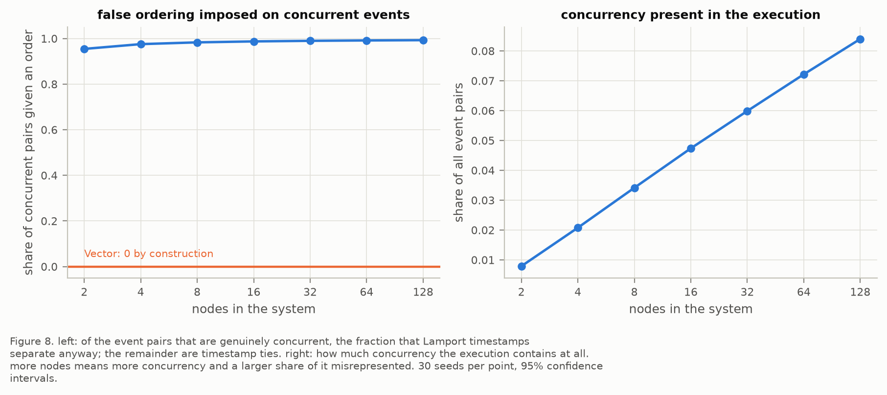
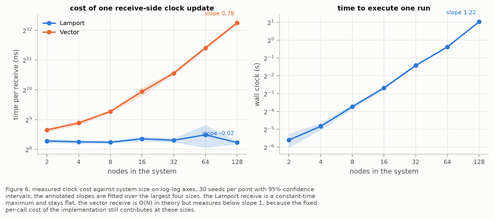
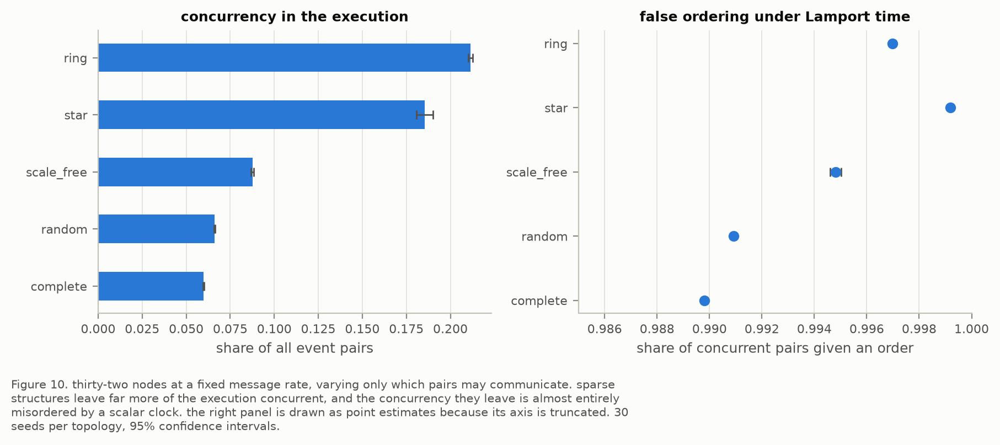

# results

1,320 simulated runs. Each one executes a distributed workload, works out which events really caused which, and then checks what each clock got right.

## the short version

Some pairs of events in a distributed system are genuinely unrelated. Neither caused the other, and no order between them means anything. A vector clock can tell you that. A Lamport clock cannot, so it puts them in some order anyway.

Three things came out of measuring how much that matters:

- **Lamport clocks order almost every unrelated pair.** Between 95% and 99.9% of them, in every configuration tested, and the share rises with system size.
- **How much that costs you depends on the workload, not the clock.** What varies is how many pairs are unrelated to begin with: under 1% in a two-node system, over 21% on a ring. That range is far wider than the error rate's.
- **Vector clocks are expensive, and compressing them would not help much here.** 16x slower per message received at 128 nodes, and the vectors are 96% full, so there is little empty space to squeeze out.

Numbers come from `results/processed/`. Regenerate them with `make generate`.

---

## how the clocks are scored

Three numbers appear throughout, all comparing a clock's verdict against what actually happened:

- **unrelated pairs** is the share of all event pairs that had no causal order between them. This is a fact about the execution, not about any clock.
- **wrongly ordered** is how many of those unrelated pairs the Lamport clock put in an order anyway.
- **order precision** is the reverse check: when the Lamport clock says one event came before another, how often that is actually true.

Vector clocks score perfectly on all three by definition, so only the Lamport figures move.

---

## how much is lost

Starting point: 8 nodes, 1,000 events each, 30 runs.

| measure                   | value  |
| ------------------------- | ------ |
| events per run            | 10,006 |
| unrelated pairs           | 3.42%  |
| of those, wrongly ordered | 98.31% |
| order precision           | 96.64% |

So 3.42% of pairs had no real order, and the Lamport clock invented one for 98.31% of them. The other way round: when the clock claims one event came first, it is wrong about one time in thirty.

### bigger systems lose more

| nodes | unrelated pairs | wrongly ordered | share of all pairs affected |
| ----- | --------------- | --------------- | --------------------------- |
| 2     | 0.79%           | 95.44%          | 0.75%                       |
| 4     | 2.08%           | 97.54%          | 2.03%                       |
| 8     | 3.42%           | 98.31%          | 3.36%                       |
| 16    | 4.74%           | 98.73%          | 4.68%                       |
| 32    | 5.99%           | 98.98%          | 5.93%                       |
| 64    | 7.22%           | 99.15%          | 7.16%                       |
| 128   | 8.40%           | 99.28%          | 8.34%                       |

Two things get worse at once. More nodes leave more of the execution unrelated, and the clock also misorders a bigger share of it. The only way a Lamport clock can signal "these two are unrelated" is by giving them the same number, and that gets rarer as the system grows: it happens for 4.56% of unrelated pairs at two nodes, 0.72% at 128.

The last column is the one to quote. A 99% error rate sounds alarming, but it applies only to the unrelated pairs, which are a small slice of the whole. Out of *all* event pairs, 8.34% end up misrepresented at 128 nodes.

---

## what the vector clock costs

Size is simple arithmetic: 8 bytes for a Lamport timestamp at any scale, 8 bytes per node for a vector one. At 128 nodes that is 1KB on every message instead of 8 bytes.

Time, measured per message received:

| nodes | Lamport | vector  | vector is     |
| ----- | ------- | ------- | ------------- |
| 2     | 311ns   | 402ns   | 1.30x slower  |
| 8     | 302ns   | 618ns   | 2.05x slower  |
| 32    | 316ns   | 1,510ns | 4.78x slower  |
| 128   | 300ns   | 4,873ns | 16.28x slower |

Lamport stays flat, which is what you expect from a single addition. A vector clock merges one number per node, so it grows with the system.

The obvious question is whether the vectors could be compressed, since a mostly-empty one could travel as a short list instead. In these workloads they are not empty: 96% of entries are non-zero at 128 nodes, because everyone hears from everyone eventually. Even the ring, the most spread-out layout tested, is 89% full.

---

## what actually changes the outcome

### how much the nodes talk

| messages sent   | unrelated pairs | order precision |
| --------------- | --------------- | --------------- |
| rarely (5%)     | 10.91%          | 89.16%          |
| sometimes (25%) | 3.42%           | 96.64%          |
| often (90%)     | 1.56%           | 98.48%          |

Messages are what create order between nodes, so more talking means fewer unrelated pairs. Precision suffers most when nodes are quiet: at a 5% message rate, more than one in ten of the orderings a Lamport clock reports is invented.

### who can talk to whom

Same 32 nodes, same message rate, only the wiring changes:

| layout     | unrelated pairs | wrongly ordered |
| ---------- | --------------- | --------------- |
| complete   | 5.99%           | 98.98%          |
| random     | 6.61%           | 99.09%          |
| scale-free | 8.76%           | 99.48%          |
| star       | 18.54%          | 99.92%          |
| ring       | 21.14%          | 99.70%          |

Ring and star are worst, for opposite reasons. In a ring, news travels the long way round and spreads slowly. In a star everything is two hops away, but two leaves can only reach each other through the hub, so whatever they do between hub visits is invisible to each other.

This is the biggest effect in the study. Changing the wiring moved the unrelated share by 3.5x, more than going from 8 nodes to 128 did.

### how slow the network is

| average delay | fixed delay | uniform | exponential |
| ------------- | ----------- | ------- | ----------- |
| 1             | 1.86%       | 1.85%   | 1.83%       |
| 10            | 4.29%       | 3.93%   | 3.42%       |
| 50            | 12.25%      | 9.21%   | 6.65%       |

(unrelated pairs, 8 nodes)

Slower networks leave more unrelated. A 50x slower network produced 6.6x more unrelated pairs. Which *kind* of delay barely matters at first and starts to matter once delays get long, because an exponential distribution delivers plenty of messages far quicker than its average, and those early arrivals restore order that a fixed delay does not.

### dropped messages and crashes

Both were swept together. Both destroy messages, and a message that never arrives creates no order. At the worst case tested, 25% of messages dropped and a 2% chance of a node crashing each step, unrelated pairs rose from 3.42% to 4.41% and 952 events disappeared along with the receives that would have produced them.

Worth being clear about what this does not show. Neither clock recovers anything from a lost message. The order was never created, so there is nothing to recover, and both clocks correctly report the thinner order that remains. None of it says anything about fault tolerance.

---

## what it adds up to

All of it comes from one thing. A Lamport clock is a single number, and single numbers always sort into a line. A real execution is not a line, because parts of it happen independently. The gap between the two is exactly the set of unrelated pairs, and anything that widens that gap widens the error.

The error rate itself barely moves, sitting in the 95% to 99.9% band everywhere. What moves, by more than 20x, is how much of the execution it applies to, and that is decided by the workload: how chatty the nodes are, how they are wired, how slow the network is.

The cost side needed no experiment to predict. A vector clock is `N` numbers instead of one, so it costs `N` times the space and roughly `N` times the work. What the measurements add is the real multiplier: 16x per received message at 128 nodes, on this machine.

---

## caveats

1. **This is a simulation.** No real network, no operating system scheduler, no clock drift. The ordering results are exact facts about the executions and would hold anywhere. The nanosecond timings describe one laptop and would not.
2. **Timings are Python.** The shape of the cost is real; the specific multipliers would shrink in a compiled language.
3. **Memory figures are a floor**, because Python reuses small integers behind the scenes.
4. **The workload is made up.** Nodes pick who to talk to at random, with random gaps between events. Real systems have request/response patterns and bursts.
5. **One thing varies at a time**, so combinations such as a slow network on a ring are untested.
6. **Only full vectors were measured.** The compression schemes are discussed but not tested.
